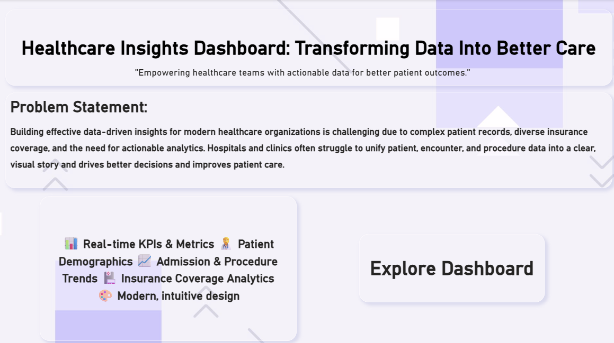

# Healthcare Insights Dashboard

## 🚀 Overview

Welcome to the Healthcare Insights Dashboard—your all-in-one business intelligence solution for hospitals, clinics, and healthcare administrators. This dashboard transforms complex patient, clinical, and financial data into clear, actionable intelligence using Power BI's most modern and impactful design techniques.

---

## 📌 Problem Statement

Healthcare organizations today face overwhelming data: scattered patient records, complex insurance claims, and ever-changing admission trends. Managers and clinicians struggle to unify information, spot key patterns, and make timely decisions that improve care and operations.

This project was born from a simple question:

> _How can we turn raw hospital data into meaningful, visual stories that drive smarter decisions and genuine impact in patient care?_

---

## 💡 Solution & Impact

The Healthcare Insights Dashboard bridges the gap between raw healthcare data and real-world outcomes. With advanced visuals, intuitive layouts, and real-time KPIs, the dashboard empowers teams to:

- Understand patient populations and admission trends
- Analyze insurance coverage and financial performance
- Monitor clinical activities—procedures, visit reasons, and stay durations
- Benchmark organizational performance for strategic improvement

This interactive report puts the **power of insight** into the hands of administrators, analysts, and clinicians for better outcomes and informed strategy.

---

## 🎨 Report Structure & Key Features

**1️⃣ Introduction Page (Welcome & Problem Framing)**  
Sets the scene: What’s the challenge, and why does it matter?

**2️⃣ KPI Overview (Executive Summary)**  
- Total Patients
- Total Encounters
- Average Encounter Cost
- Insurance Coverage %

**3️⃣ Patient Demographics**  
- Age, Gender, Race/Ethnicity, Marital Status
- Geographic distribution of patient base

**4️⃣ Financial & Cost Analysis**  
- Revenue, Coverage, Out-of-Pocket KPIs
- Monthly cost breakdown by insurer
- Coverage comparison/bar charts
- Claim trends over time

**5️⃣ Procedures & Clinical Insights**  
- Most common procedures and visit reasons
- Procedure volume vs. cost bubble chart
- Patient length of stay (with histogram and averages)

_All visuals styled for clarity and accessibility, using modern card grids, rounded corners, glass effects, and a cohesive color palette._

---

## ✨ What Makes This Dashboard Impressive?

- Human-centered design for non-technical users—no guesswork, immediate insight
- Color-coded KPIs and trend highlights for visual clarity
- Dynamic filtering and cross-chart interactivity
- Actionable insights per page, not just numbers
- Scalable structure—add new modules with ease

---

## 🧩 How To Use

1. Download or clone this repo.
2. Open the `.pbix` file in Power BI Desktop.
3. Load your hospital dataset or use the sample CSVs provided.
4. Instantly interact—filter, click, and explore!

For Figma/brand assets, see the `/design` folder.

---

## 📊 Technologies Used

- Power BI: Data modeling, DAX measures, visualization
- DAX: KPI logic, calculated columns, segmentation
- Figma: Design assets (backgrounds, icons, typography)
- CSV datasets: Patients, organizations, payers, procedures

---

## 🤝 Collaboration & Extensions

Suggestions, feature requests, and data enrichment ideas welcome!  
Fork/PR or open an issue to contribute.  
Custom modules for your organization? Get in touch!

---

## 📍 Author

**Sai Balaji R**  
Data Analyst  
Chittoor, AP, India

---

## 🏆 Project Highlights

- Portfolio-ready design
- Indian healthcare context with global best practices
- Ready for presentations, interviews, and deployment

---

## 📬 Contact & Support

For demo requests, help, or integration, raise a GitHub Issue or email.

---

Transform your data. Improve your care. **Make decisions that matter.**
